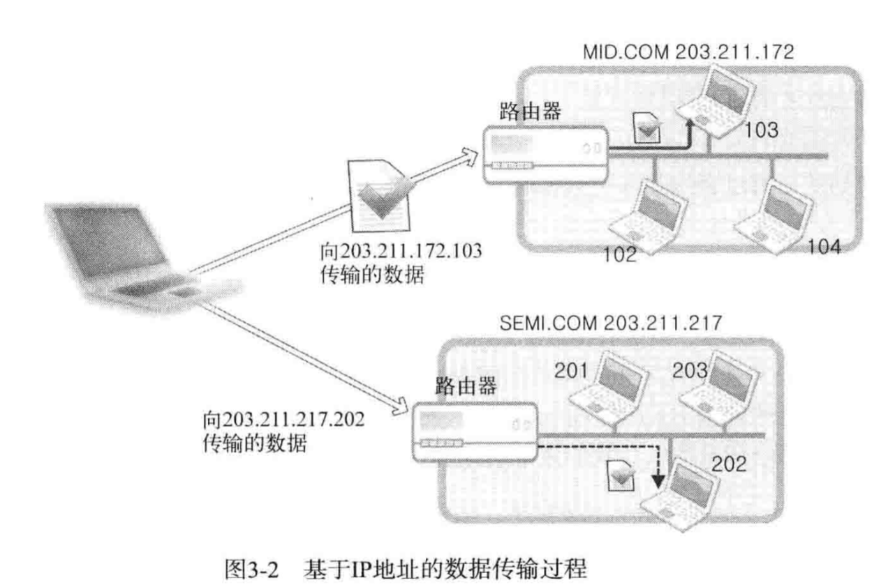
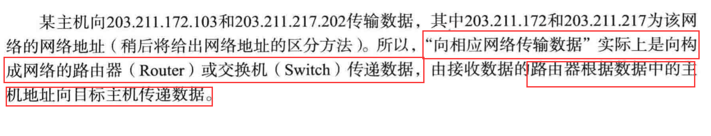
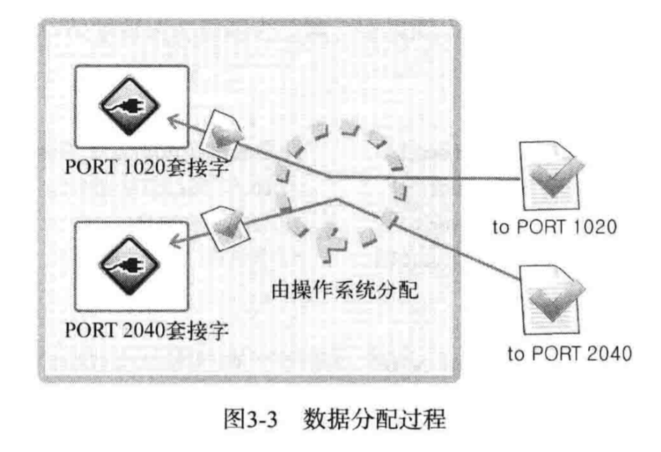
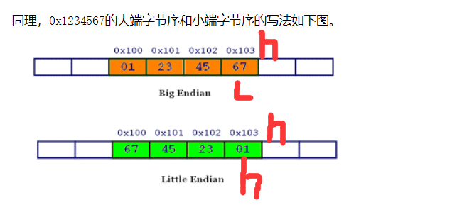
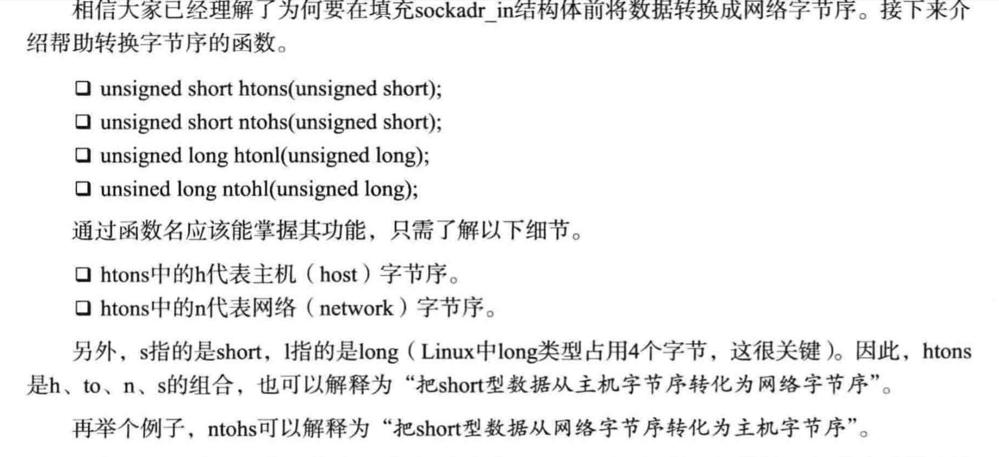

# 地址族与数据序列

## 分配给套接字的IP地址与端口号

1. 网络地址：

 - Ipv4地址族：
 
 
 - 网络地址（网络ID）是用来区分网络而设置的“一部分”IP地址
 
 
 
2. 用于区分套接字的端口号

 - 端口号就是在同一操作系统内为区分不同套接字而设置的，
 因此无法将1个端口号分配给不同套接字。
 
 - 可分配的端口号的范围：0-65535,0-1023一般分配给特定应用程序。
 
 - TCP套接字和UDP套接字不会共用端口号，所以允许重复。
 
 - 数据分配过程：
 
 

## 网络字节序与地址变换

1. 字节序与网络字节序：
 - 大端序：高位字节存放到地位地址。
 - 小端序：高位字节存放到高位地址。
 
 
2. cpu向内存保存数据的方式有大端序和小端序2种，
 但是网络字节序需要统一，统一为大端序。
 
3. 字节序转换：
 
 
 
 