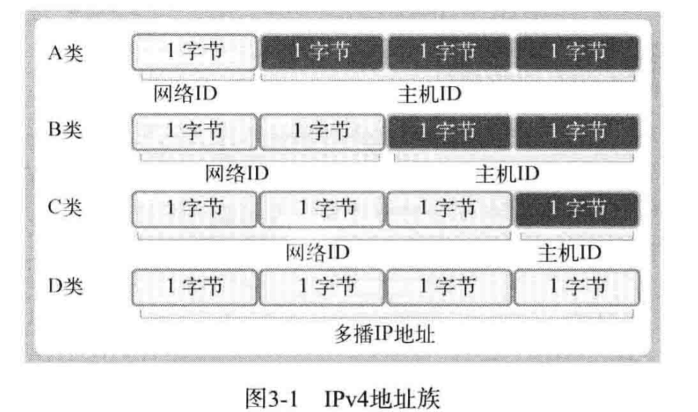

# 地址族与数据序列

## 分配给套接字的IP地址与端口号

1. 网络地址：

 - Ipv4地址族：
 
 
 - 网络地址（网络ID）是用来区分网络而设置的“一部分”IP地址
 
 
 
2. 用于区分套接字的端口号

 - 端口号就是在同一操作系统内为区分不同套接字而设置的，
 因此无法将1个端口号分配给不同套接字。
 
 - 可分配的端口号的范围：0-65535,0-1023一般分配给特定应用程序。
 
 - TCP套接字和UDP套接字不会共用端口号，所以允许重复。
 
 - 数据分配过程：
 
 

## 地址信息的表示

1. 