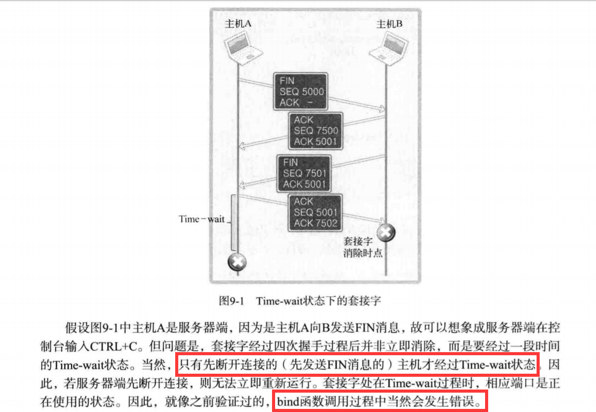
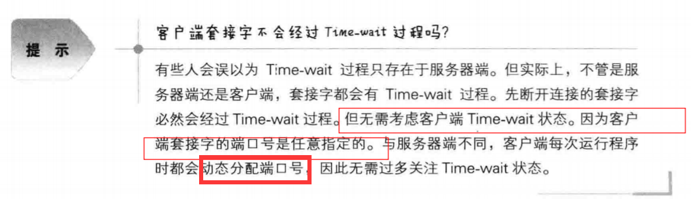
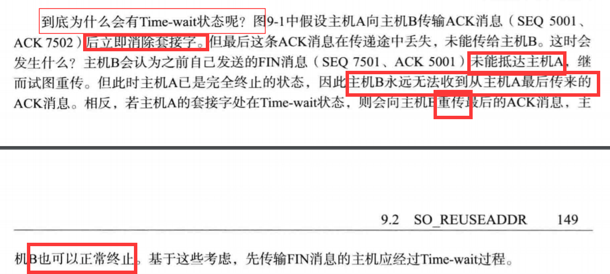
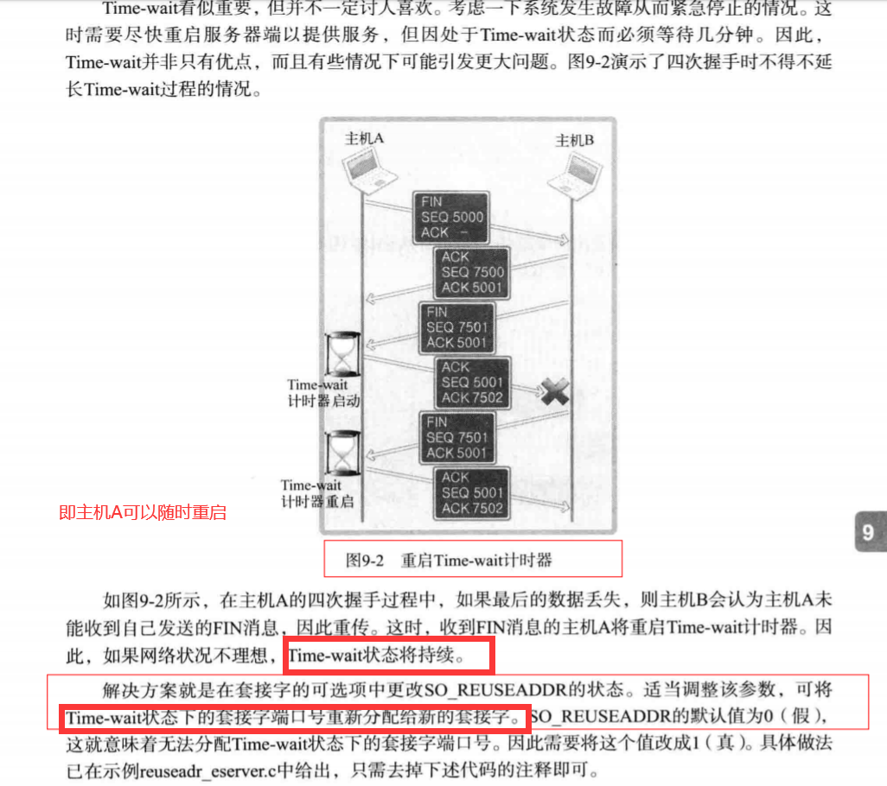
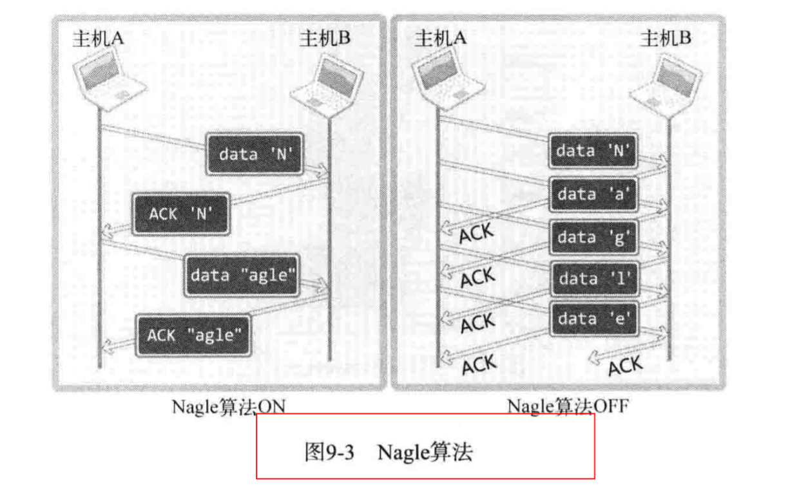
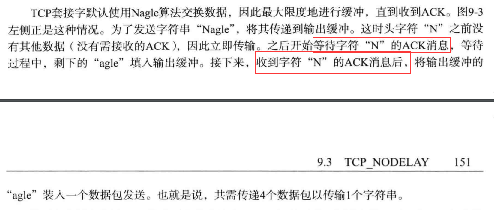
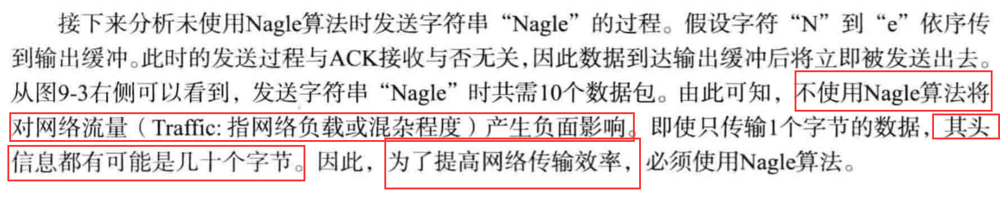
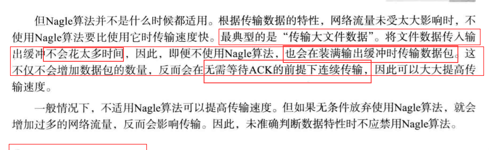

# 套接字的多种可选项

1. Time-wait状态：

 - 四次挥手：服务器端先断开连接，则会在一定时间段内处于Time-wait状态，
 此时socket仍然占用端口，因此bind函数会执行出错，因此短时间内无法重启。
 
 
 - 客户端的Time-wait：
 
 
 - 为什么会有Time-wait状态：
 
 
 - 地址再分配：
 
 
2. TCP_NODELAY:

 - Nagle算法：为了防止因数据包过多而发生的网络过载，
 只有收到前一数据的ACK消息时，Nagle算法才发送下一数据，
 TCP套接字默认使用Nagle算法，因此最大限度地进行缓冲，
 直到收到ACK。
 
 
 
 - Nagle算法的优点：
 
 
 - 什么时候Nagle算法不适用：
 
 

