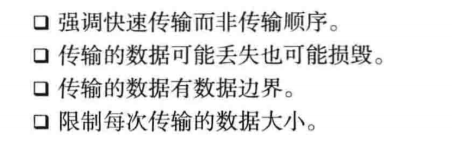

# 套接字类型与协议设置

## 套接字协议及其数据传输特性

1.协议族：

2.套接字类型(指的是套接字的数据传输方式)：

 面向连接的套接字（SOCK_STREAM，socket函数的第一个参数）：
    
   - 特征：传输过程中数据不会消失，
    按序传输数据，传输的数据不存在数据边界,
    套接字连接必须一一对应；
    
   - 套接字缓冲已满是否意味着数据丢失?
    
    
   - 一句话概括面向连接的套接字：可靠的、按需传递的，
    基于字节的面向连接的数据传输方式的套接字。
    
 面向消息的套接字（SOCK_DGRAM，socket函数的第二个参数）：
    
   - 特征：
    
   
   - 特征概括：不可靠的、不按序传递的，以数据的高速传输为目的的套接字。
   
 协议的最终选择（socket函数的第三个参数）：
   
   - 为什么？
   同一个协议族中可能存在多个传输数据方式相同的协议，因此需要这个字段来最终确定。
   
    
    
    
