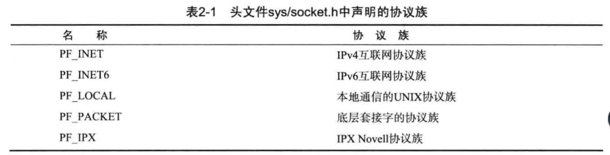
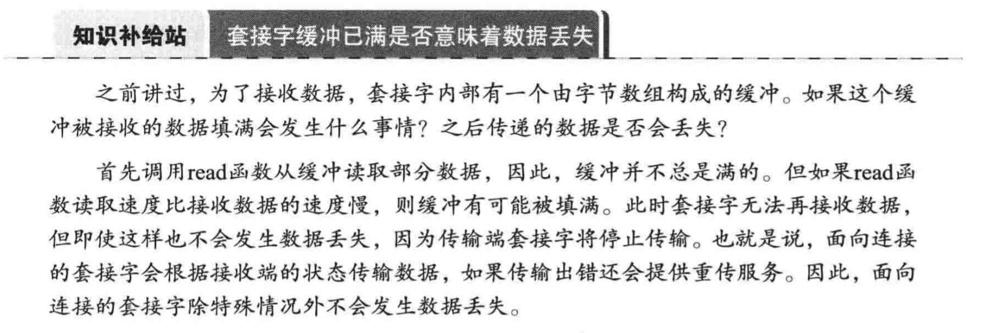

# 套接字类型与协议设置

## 套接字协议及其数据传输特性

1.协议族：

2. 套接字类型(指的是套接字的数据传输方式)：

 面向连接的套接字（SOCK_STREAM）：
    
    a. 特征：传输过程中数据不会消失，
    按序传输数据，传输的数据不存在数据边界,
    套接字连接必须一一对应；
    
    b. 套接字缓冲已满是否意味着数据丢失?
    
    
    c. 一句话概括面向连接的套接字：可靠的、按需传递的，
    基于字节的面向连接的数据传输方式的套接字。
    
    
    
    
