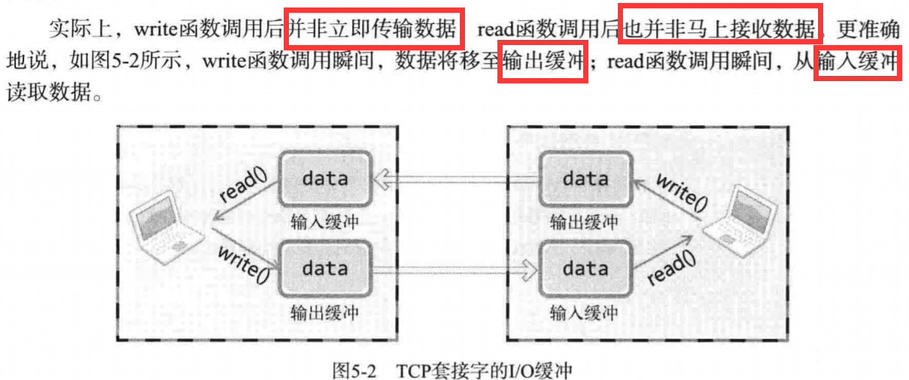
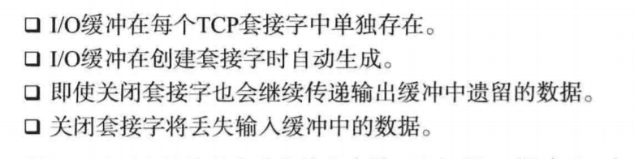
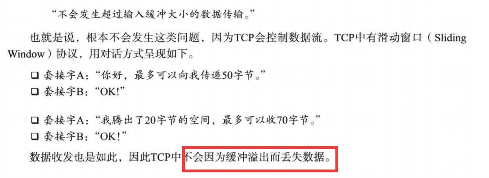
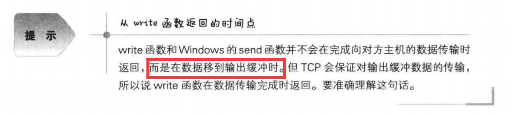
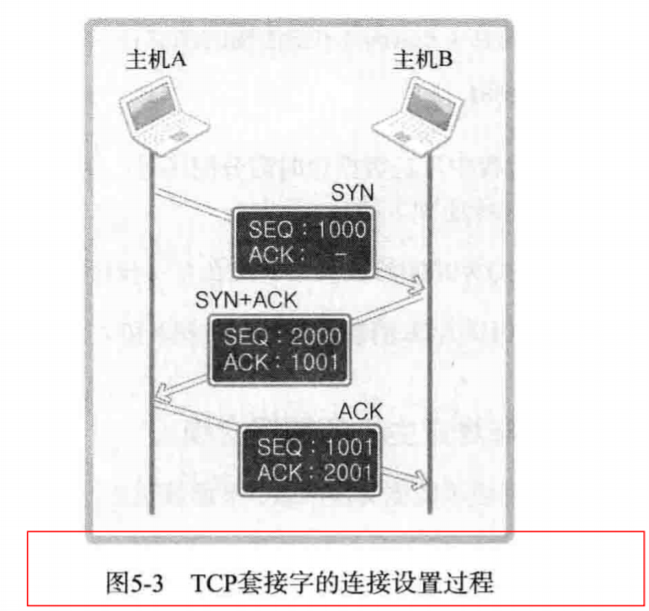
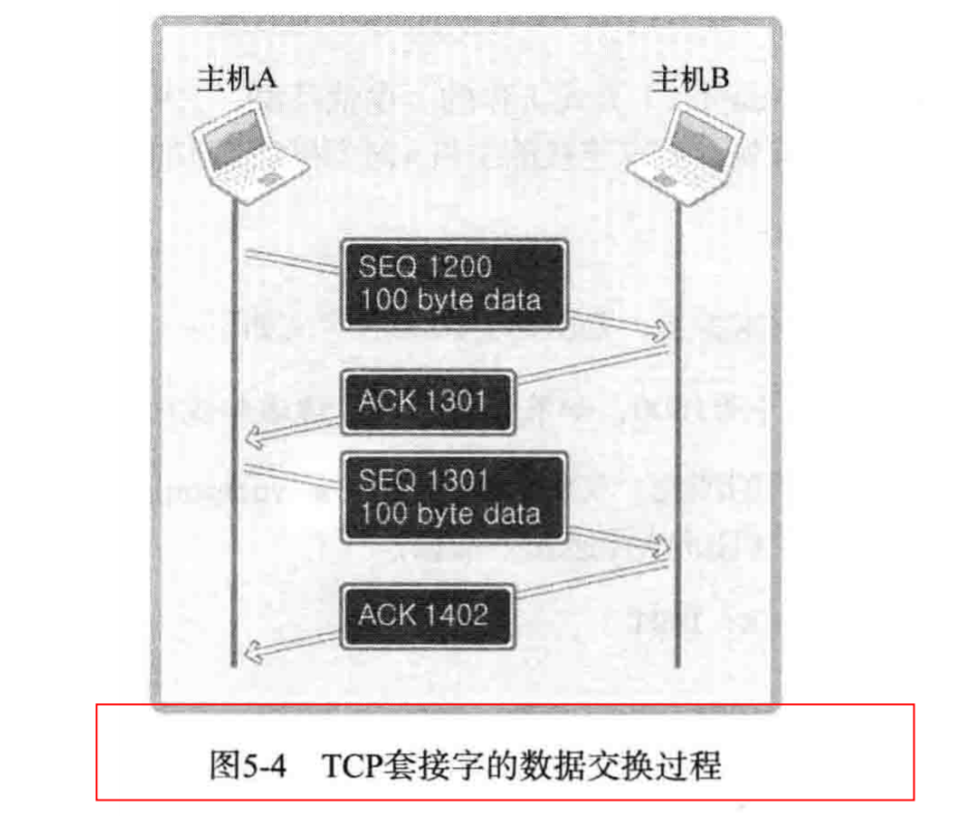
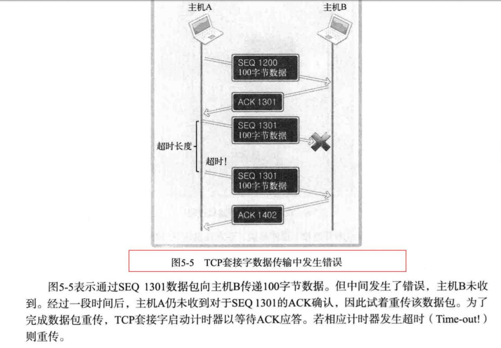
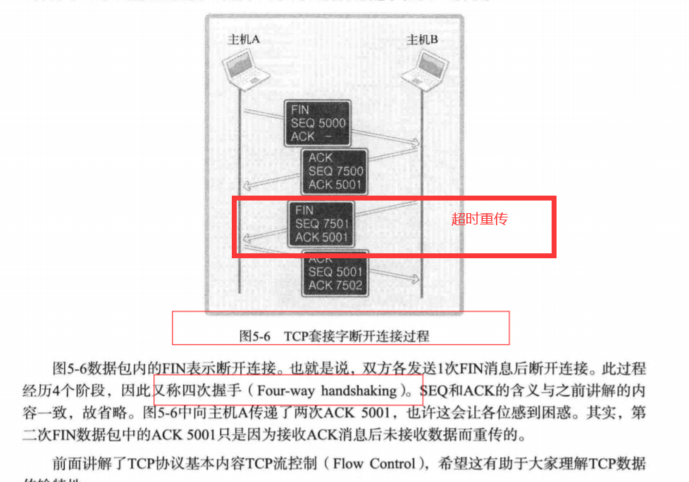

# 基于TCP的服务端与客户端（2）

## 回声客户端的完美实现

1. 客户端接收数据时，应确定接收的数据大小；

2. 或者，可以在应用层协议上定义数据边界，接收到数据边界就停止；

## TCP原理

1. TCP套接字中的I/O缓冲：

 - TCP套接字中的I/O缓冲：
 
 
 - I/O缓冲的特性：
 
 
 - TCP数据传输不会发生超过输入缓冲大小的数据传输：
 
 
 - write函数返回的时间点:
 
 
2. TCP的连接建立：

 - 三次握手：
 
 
 - 与对方主机的数据交换
 
 > ACK号 = SEQ号 + 传递的字节数 + 1（加1是为了告知对方下次要传递的SEQ号）
 
 - 传输过程中数据包消失的情况
 
 
3. 断开与套接字的连接：

 - 四次挥手：
 
 
 
 