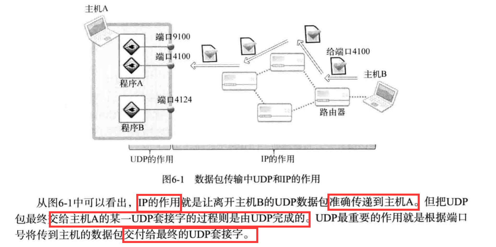
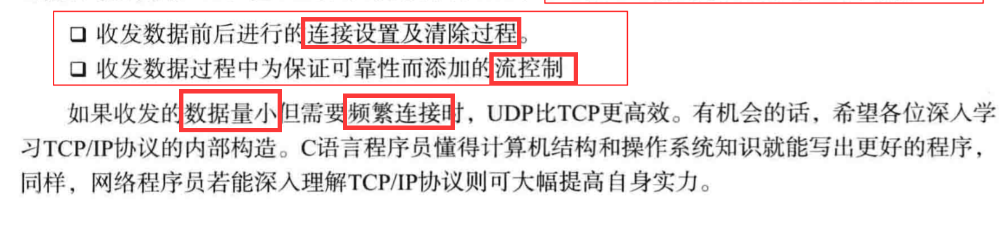
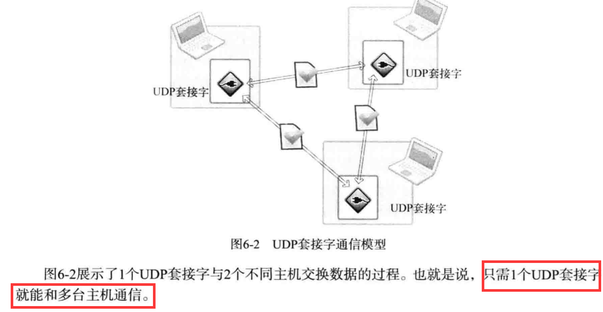
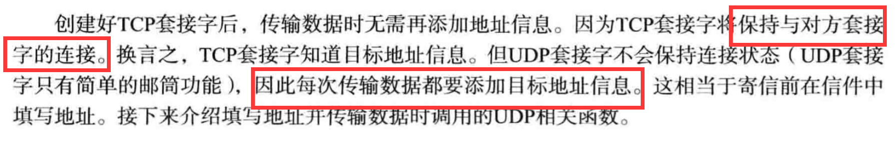
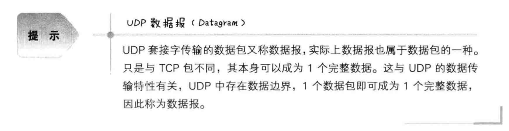
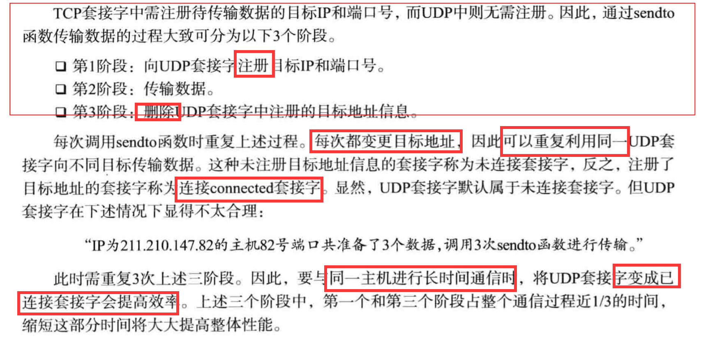

# 基于UDP的服务端与客户端

## UDP内部工作原理

1. 数据包传输中UDP和IP的作用：

2. UDP的高效使用：
 - TCP比UDP慢的原因：
 
 

## 实现基于UDP的服务端与客户端

1. UDP中的服务端和客户端没有连接：

 - UDP服务端和客户端均只需1个套接字:
 
 
 - 基于UDP的数据IO函数
 
 
2. UDP的数据传输特性和调用connect函数

 - 存在数据边界的UDP套接字：UDP具有数据边界，
 输入函数的调用次数应该和输出函数的调用次数完全一致，
 这样才能保证接受全部已发送的数据。
 
 - UDP数据报：
 
 
3. 已连接UDP套接字与未连接UDP套接字

 - UDP通过sendto函数传输数据的3个阶段
 
 
 - 创建已连接UDP套接字：只需要针对UDP套接字调用connect函数。
 
 - 针对UDP套接字调用connect函数并不意味着要与对方UDP套接字连接，
 这只是向UDP套接字注册目标IP和端口信息。