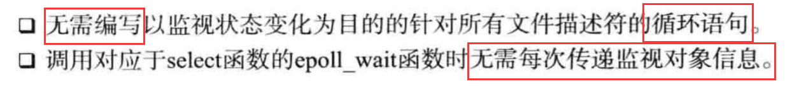
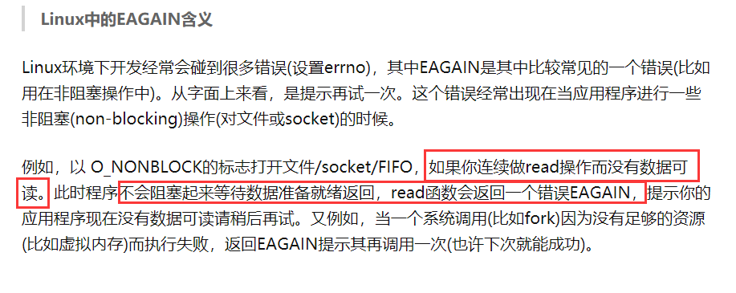

# 优于select的epoll

## epoll理解及应用

1. 基于select的I/O复用技术速度慢的原因：

 - 调用select函数后常见的针对所有文件描述符的循环语句（忙等待）；
 
 - 每次调用select函数时都需要向该函数传递监视对象的信息（每次都需要重置监视对象）；
 
 - 每次调用select函数时需要向OS传递监视对象信息，会陷入到内核态，耗时；
 
 - 解决方案：仅向操作系统传递1次监视对象，监视范围或内容发生变化时，
 只通知变化的事项（linux的epoll就支持）；
 
2. select的优点：

 - select的平台适用性比较好，大多数操作系统都支持；
 
3. epoll的实现：

 - epoll的优点：
 
 
 
## 条件触发和边缘触发

1. 条件触发和边缘触发的区别在于发生事件的时间点：

 - 条件触发：只要输入缓冲有数据，就会一直通知该事件；
 
 - 条件触发的时机：
 
 
 - 边缘触发的时机：输入缓冲收到数据时，仅注册1次该事件，
 即使输入缓冲中还有数据，也不会再进行注册；
 
2. 边缘触发的服务器端实现中必知的两点：

 - 通过errno变量验证错误原因：获取套接字出错的原因，
 一般用于检测读写是否完成，如果检测到错误，则说明读或写已经完成了。
 
 - 为了完成非阻塞I/O，更改套接字特性：通过fcntl指令，
 将套接字变为非阻塞的；
 
3. 条件触发（水平触发）和边缘触发孰优孰劣：

 - 边缘触发可以做到“分离接收数据和处理数据的时间点”；
 
 - 条件触发会导致大量的epoll被触发，
 而边缘触发则可以在很大程度上减少这种触发，因此具备很高的效率；
 
 - EAGAIN的含义（循环检查当前errno是不是这个，如果是则意味着，
 I/O缓存中没有数据可读了，或者是没有足够的资源可用）：
 
 
https://zhuanlan.zhihu.com/p/148972109
 
 
 