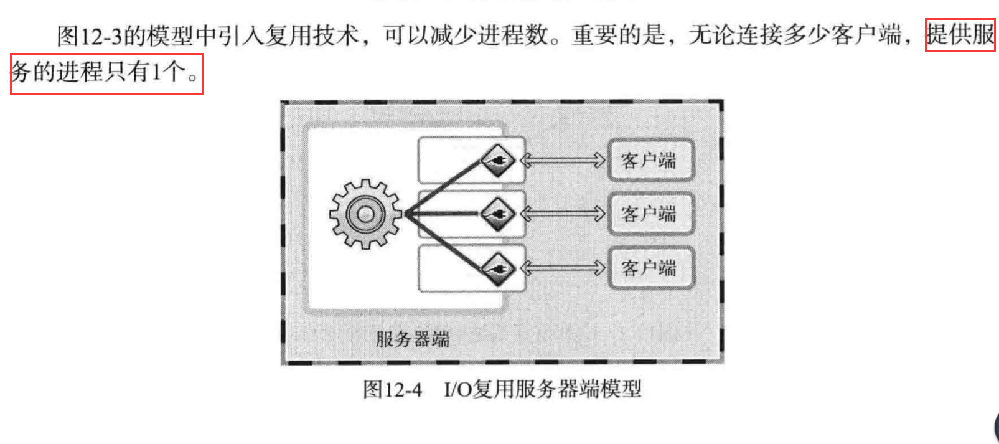
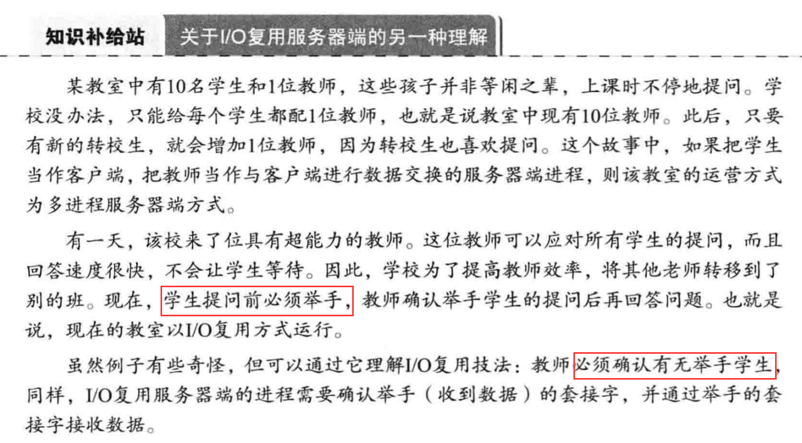
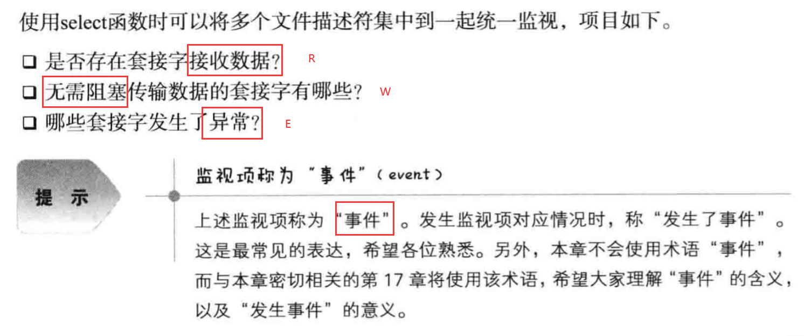
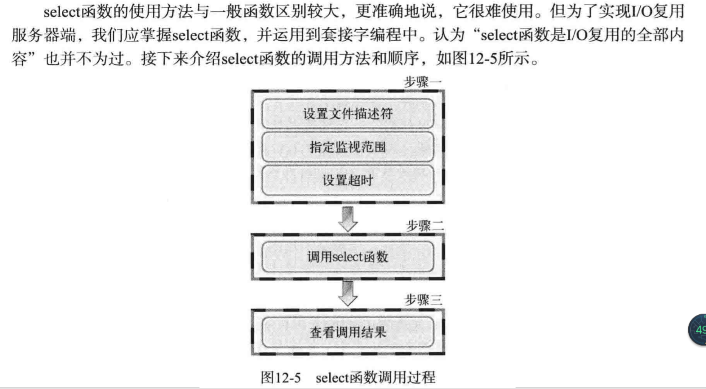
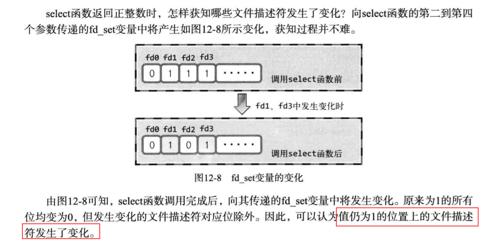

# I/O复用

## 基于I/O复用的服务器端

1. 多进程服务器端的缺点和解决方法：

 - 缺点：有连接就会创建新的进程，而创建进程时需要付出极大代价，
 需要大量的运算和内存空间。
 
2. 复用技术在服务器端的应用：

 - I/O复用服务器端模型：
 
 
 - I/O复用的理解：
 
 
## 理解select函数并实现服务器端

1. select函数的功能和调用顺序：

 - select函数的功能：
 
 
 - select函数的调用过程:
 
 
2. select监听文件描述符的变化：

