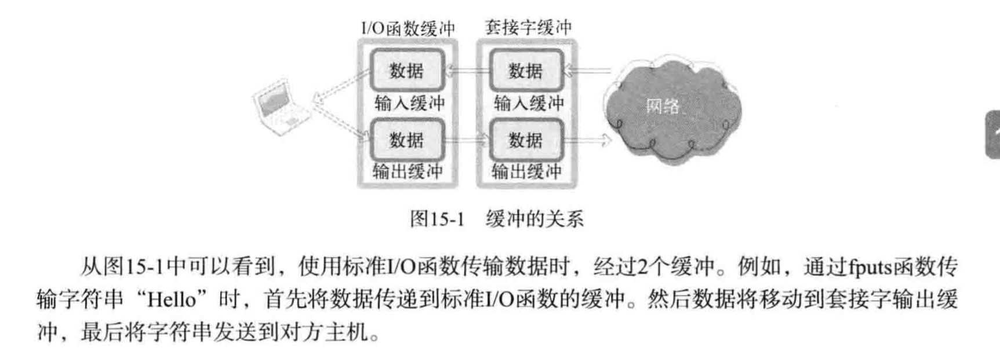
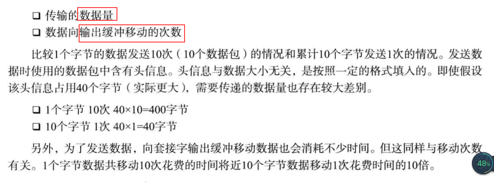

# 套接字和标准I/O

1. 标准I/O函数的优点：
 
 - 具有良好的移植性；
 
 - 可以利用缓冲提高性能：
 
 套接字中的缓冲，主要为了实现TCP协议，
 即保证TCP传输中丢失数据的重传。
 而标准I/O函数中的缓冲主要为了提高性能：
 
 
2. 标准I/O函数的缺点：

 - 不容易进行双向通信；
 
 - 又是可能频繁调用fflush函数（标准IO，在读写切换时，需要调用fflush函数）
 
 - 需要一FILE结构体指针的形式返回文件描述符；