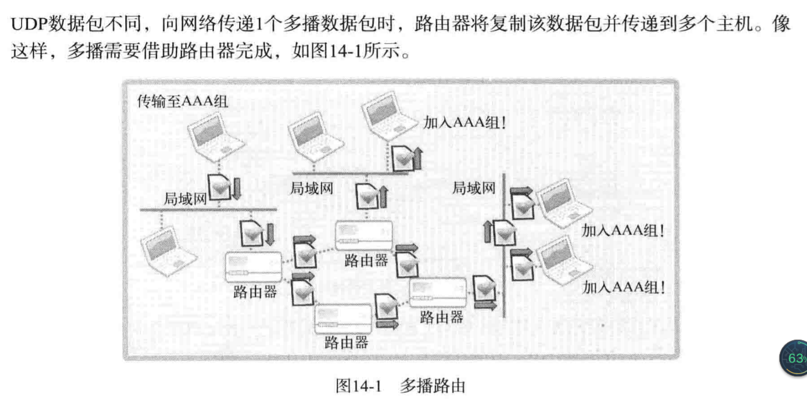
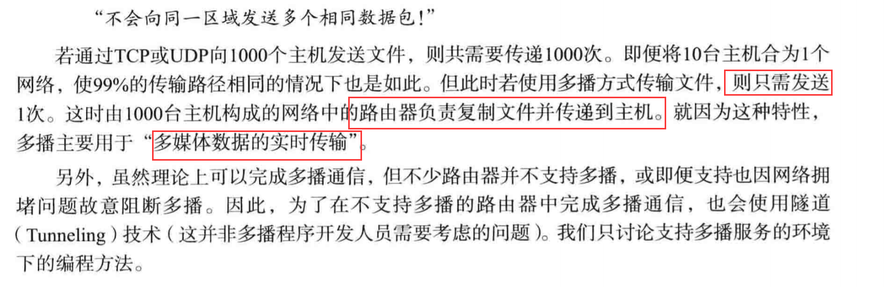
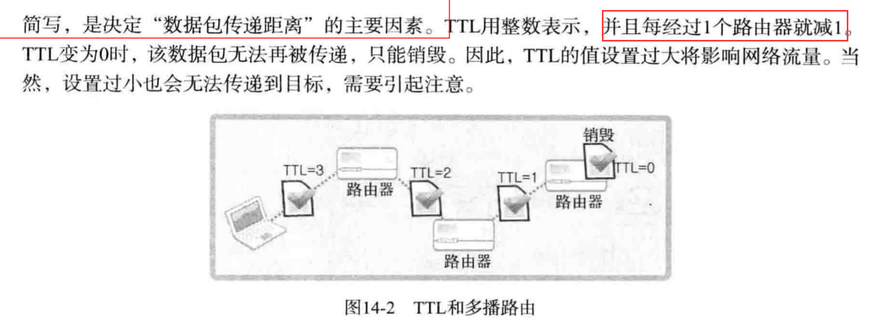
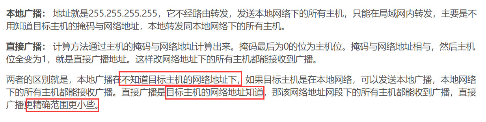

# 多播与广播

## 多播
> 多播方式的数据传输是基于UDP完成的

1. 多播的数据传输方式及流量方面的优点：

 - 多播的数据传输特点：
 
 
 - 多播路由：
 
 
 - 多播不会向同一区域发送多个相同数据包：
 
 
2. 路由和TTL（生存时间），以及加入组的方法

 - TTL：
 
 
 ## 广播
 > 多播可以跨越不同的网络，而广播只能向同一网络中的主机传输数据
 1. 广播的理解及实现方法：
 
  - 直接广播与本地广播：
  