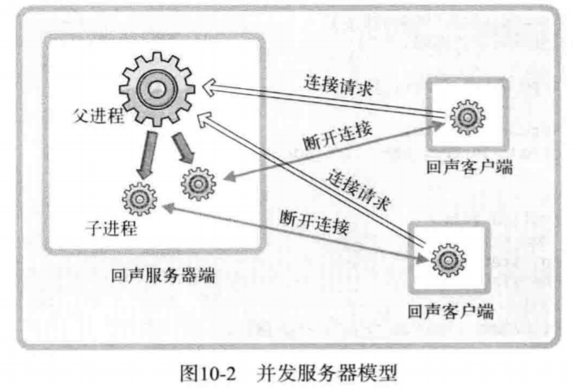
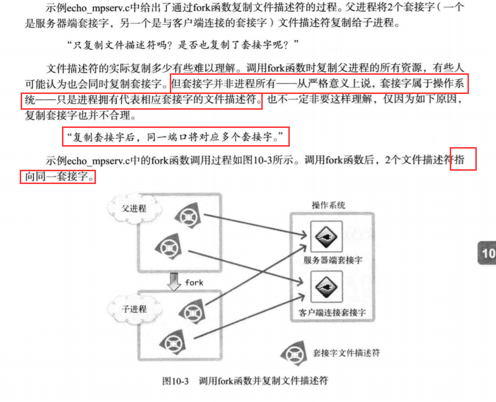
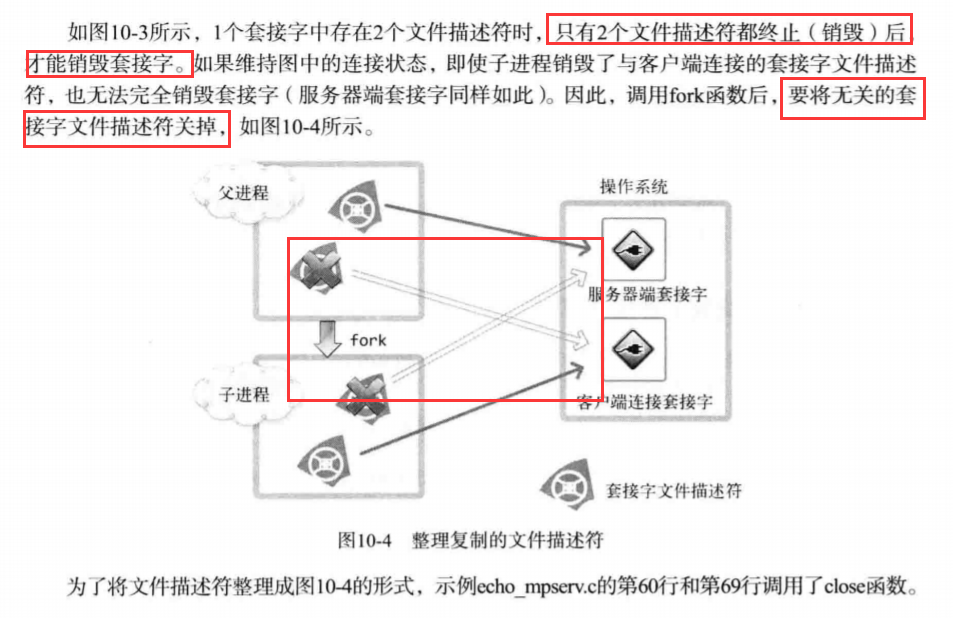

# 多进程服务器端

## 进程概念及应用

1. 并发服务器端的实现方法：
 
 
2. 理解进程：
 - CPU核的个数与进程数：
 
 
 - 通过调用fork函数创建进程：
 
 
## 进程和僵尸进程
 
1. 僵尸进程：
 - 产生僵尸进程的原因：
 
  
## 基于多任务的并发服务器

1. 基于进程的并发服务器模型：
 - 基于进程的并发服务器模型：
 
 
 - 基于进程的并发服务器模型流程:
 
 
 - 通过fork函数复制文件描述符：
 
 
 - 消除掉无关的文件描述符:
 
 

## 分割TCP的I/O程序
 