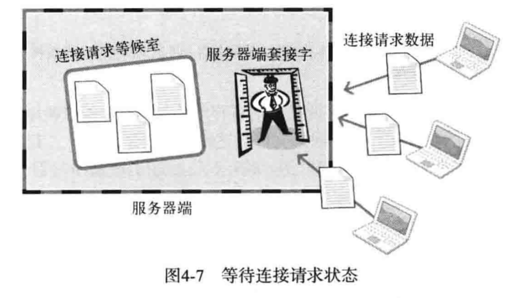
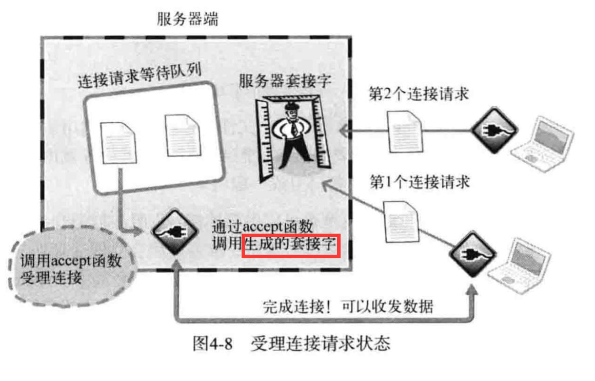
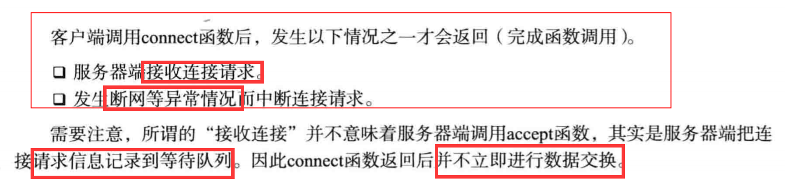
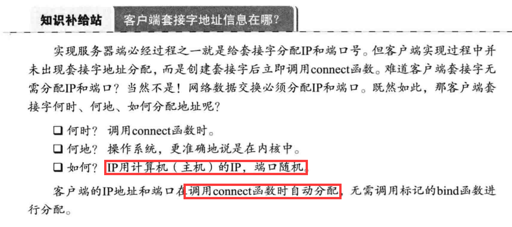
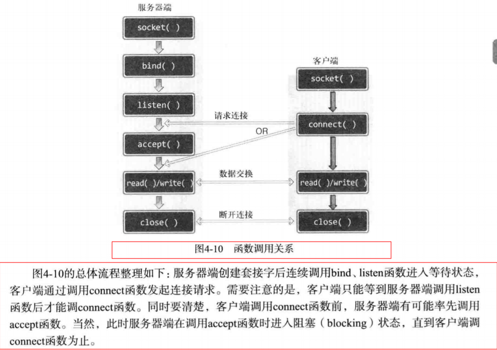

# 基于TCP的服务端与客户端（1）

## 实现基于TCP的服务端/客户端

1. 进入等待连接请求状态（调用完listen之后）：

 - 只有服务端调用完listen之后，客户端connect才有效；
 
 
 - listen函数的作用：
 
 
2. 受理客户端连接请求：
 
 - 服务端套接字做门卫，用来接收请求，
 新建套接字（通过accept函数实现）用来和客户端连接进行数据交互：
  
 
 - accept受理连接请求的流程：
 服务端会单独创建新的套接字与客户端套接字进行数据交互
 
 
3. TCP客户端的默认函数调用顺序

 - 客户端调用connect函数的返回条件：
 
 
 - 客户端套接字的地址信息：
 

4. 基于TCP的服务端/客户端函数调用关系:

 - 基于TCP的服务端/客户端函数调用关系:
 
 